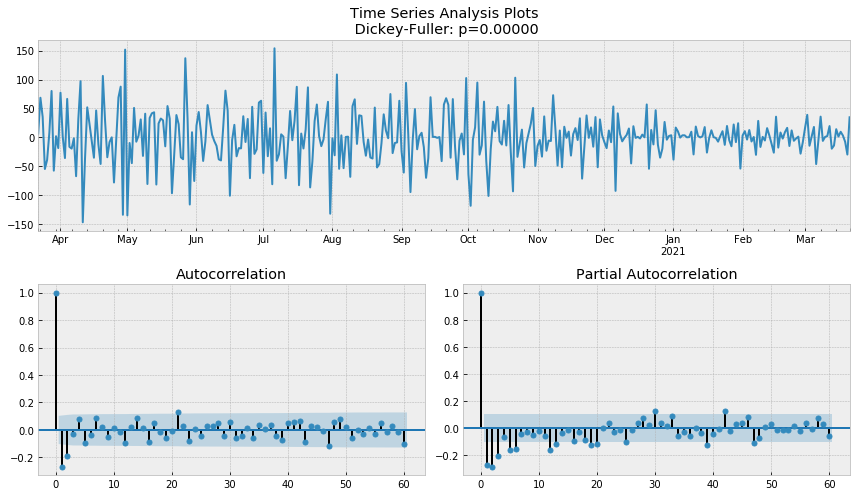

# Electricity-Forecasting
## Command 
`python app.p``y` `--``training` `"``Your Training Data``"` `--output submission.csv`

## Our Idea
### SARIMA 模型配適
1. 觀察時間序列走勢，繪製ACF及PACF

2. 經過ACF圖形得知原時間序列不平穩，並透過Dickey-Fuller差分檢定，決定原時間序列需做一階差分。

3. 透過Box-Cox檢定找出Box-Cox transformation之lambda

4. 透過Grid-Search找出SARIMA模型之hyperpareters

5. 模型配適
6. 預測未來7天備載容量